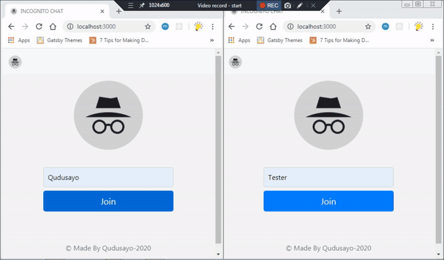

# INCOGNITO-CHAT

<p align="center"></p>
<p align="center"><b>CHATTING IN INCOGNITO</b></p>

A cool chat Using Socket io [Live Here](http://chatty-lib.herokuapp.com/)

<p align="center"></p>

## Running Locally

+ clone this repository
+ run ```npm install```
+ run  ```npm start```
+ open http://localhost:3000 in differnt browsers to chat!!

